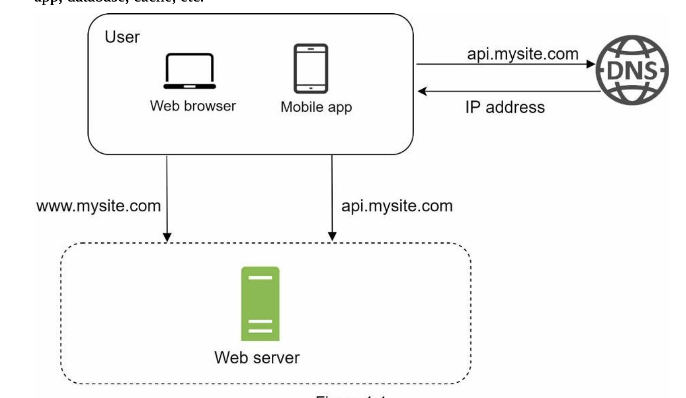

### System Design Interview By Alex Xu

## Chapter 1 - Scale From 0 to 1M

Begin with a simple system, everything being served from one server.

# Database
When userbase grows, one server won't be enough. We'll need multiple servers. One for mobile/web traffic and another for the DB. Separation allows them to be scaled individually.

User -> Web Server -> DB

DB can be written to/read/updated but ONLY return data to web server.

# Types of Databases
Relational DB: SQL/MySQL/PostreSQL. Stored in tables/rows and you can perform join operations on different tables.

Non-Relational DB: DynamoDB, MongoDB, etc. Databases are grouped into four categories:
- K/V stores
- Graph stores
- Column stores
- Document stores

Relational normally better but non-relational makes sense when:
- Need low latency
- Unstructured data
- Serialize/deserialize data i.e JSON/XML/YAML
- Store a lot of data

# Vertical vs Horizontal Scaling
Vertical: Upgrade the server with more power. Best for low traffic and simple. Has a limit & no failover/redundancy.

Horizontal: Add more servers into the resources. Redundancy for failure and infinitely scalable.

# Load Balancer
Evenly distributes incoming traffic among web servers that're defined in the Load Balancer set.

Public IP will point directly to the load balancer. Client cannot directly access the servers. Protects against failures and has redundancy.

# Database Replication
Master/Slave relationship between the original and its copies.

Master DB supports write operations ONLY while the slave database only supports reading.

Benefits: Better performance as more queries can happen in parallel.

Preservation of data.

High availability.

If the master goes offline, one of the slaves will be promoted. Failover and redundancy secured.

# Cache
Temporary storage that stores results of expensive operations or frequently accessed data in memory.
This ensures that the subsequent requests are quick.

Cache Tier: Temporary data store layer, much faster than the DB. Benefits of the tier are better performance, ability to reduce database workload, and we can scale the cache by itself.

Decisions: Use cache when data is read frequently.

# Content Delivery Network (CDN)
Network of dispersed servers used to deliver static content like images, videos, JS files.

Costs: Run by 3rd party, expensive.

User tries to get an image, they'll get it from the CDN. If it's not in the CDN, it's retrieved from the server and stored in the CDN.

# Stateless Web Tier
Scale the web tier horizontally, and removal of the users session data from the web tier.

Store session data in a relational database. Each server can access data from the databases.

IF IT WAS STATEFUL: Each server holds the session data for the user.

WITH STATELESS: HTTP reqs from users can be sent to any server. Which can fetch state data from a shared data store.

Simpler and more scalable.

# Data Centers
Placing the servers and DBs and Caches all into data centers. Will route to the closest one to the user to minimize latency.

In event of outage, we direct all traffic to a healthy data center.

Data Synch: Rather than placing only local data, all data is replicated across data centers. 
This way, in an outage, the users can see all data if their local center goes down.

# Message Queue
Stored in memory that supports async communication.
Distributes async requests.
Input services create messages and put them in the queue. Subscribers connect to the queue, and perform the action.

Allows either party to work by itself and be scaled.

# Logging, Metrics, and Automation
Need system logs to find problems.
Need metrics to gain insights into the business and understand health of system.
Automation: Improve productivity, automated deployments/tests as the codebase gets big.

# Database Scaling
Vertical: Adding hardware. Higher risk of single point failure. Higher cost of vertical scaling & hard limit.

Horizontal: Sharding the dataset with more servers.
Breaks DBs into smaller parts, each shard has same schema but the data is unique per shard.

### Chapter 2: Back of Envelope 

# Power of Two
1 Byte = 8 bits
2 ^ 10 = 1KB
2 ^ 20 = 1MB
2 ^ 30 = 1GB
2 ^ 40 = 1TB

# Latency Numbers
L1 Cache: 1ns
L2 Cache: 4ns
Main memory: 100ns

# Storage Operations
KEY NOTE: Memory is fast and disk is slow. Avoid reading from disk if possible.

# Network Operations
Sending 1KB over 1GBps 10 microseconds
Roundtrips costly as well.

Compress data before sending it and data center regionality will impact latency too.

# Availability Numbers
99% ("two nines"): 3.65 days downtime/year

99.9% ("three nines"): 8.77 hours downtime/year

99.99% ("four nines"): 52.6 minutes downtime/year

99.999% ("five nines"): 5.26 minutes downtime/year

### Framework for System Design Interviews
It's all about communication and being able to discuss tradeoffs.

# 4 Step Process for Effective Interviewing

1) Understand the problem and establish scope. Do not jump straight to any solution.

Think, clarify, and ask questions about the requirements.
Like: What features? How many users? How fast will this scale?

2) Propose high-level design and get buy-in.

Come up with an initial blueprint, ask for feedback. Treat the interviwer like your teammate.

Draw diagrams, write schema, go through some use cases.

3) Design Deep Dive.

You should have agreed on the goal, feature scope, have some feedback and a high level idea.

Work with the interviewer to prioritize components of the architecture. Go deep into these bits.

4) Wrap Up.

May receive follow-up questions about the design. They could want you to identify bottlenecks, discuss improvements.

YOUR DESIGN IS NEVER PERFECT.

Provide a recap of the design, discuss error cases, rollout technique, and scaling.

### Design a Rate Limiter